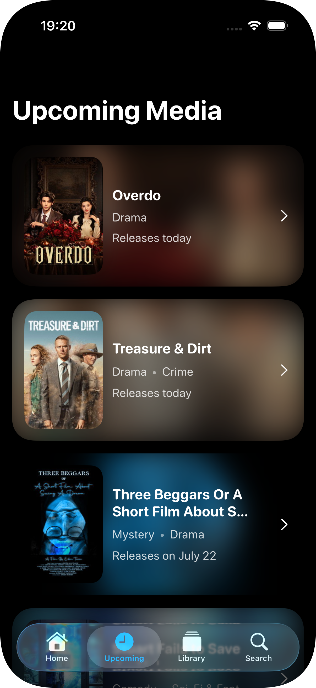

# 🎬 MovieMind

A movie, TV show & people exploration app for iOS, powered by [TMDB](https://www.themoviedb.org).
Built with SwiftUI, Swift Concurrency, and SwiftData.


<p align="center">
  
  
  
  
</p>

## Features

- **Home** — trending hero carousel with parallax header and title logos, six curated sections with Movie/TV toggles
- **Detail pages** — overview, metadata, cast, where-to-watch providers, similar titles, TV seasons & next-episode info, movie collections
- **Search** — debounced multi-search with infinite scroll pagination and de-duplicated pages
- **Upcoming** — region-aware release calendar with relative dates ("Releases on Saturday")
- **Library** — persistent watchlist (SwiftData) with category filters and swipe-to-delete
- **Region-aware content** — in-theatre listings, upcoming releases, and streaming providers all follow the device locale
- **Polished loading UX** — shimmer skeleton screens on every page; content is revealed with a fade-in only after its images are cached, so posters never pop in one by one

## Architecture

**MVVM + protocol-oriented networking:**

```
Views (SwiftUI) ──▶ ViewModels (@MainActor, ObservableObject)
                         │  ViewState<T>
                         ▼
              NetworkServicing (protocol)
                         │
                         ▼
               NetworkManager (actor)
                 TMDB REST API v3
```

```
MovieMind/
├── App/           Entry point, tab bar, assets
├── Components/    Reusable views (HeroCard, AsyncPoster, SectionView, shimmer, …)
├── Extensions/    Date/String formatting helpers
├── Models/        Codable domain models (media, details, credits, shared)
├── Networking/    Endpoints, NetworkManager, GenreStore, image prefetching
└── View/          Feature screens (Home, Detail, Search, Upcoming, Library, Collection)
```

### Key decisions

- **`ViewState<T>`** — a single enum (`idle / loading / loaded / failed`) per screen makes conflicting UI states unrepresentable; a generic `StateContainerView` renders a custom skeleton (or default spinner), a shared error + retry screen, or the content with a fade transition
- **`actor NetworkManager`** — all requests funnel through one actor; endpoints are type-safe enums behind a small `Endpoint` protocol, so adding an API call is a ~15-line enum case
- **Image prefetching** — view models warm the shared `URLCache` before flipping state to `.loaded`; detail pages await only above-the-fold hero images and cache the rest in a background task
- **Self-healing images** — `AsyncPoster` retries transient failures with backoff before settling on a placeholder
- **Value-based navigation** — components emit a `MediaRoute`; each `NavigationStack` resolves destinations centrally, keeping leaf views destination-agnostic
- **Request coalescing** — `GenreStore` (actor) deduplicates concurrent genre fetches and caches per launch
- **SwiftData** — lightweight watchlist persistence storing references, not payloads; details are always re-fetched fresh; list queries are capped with `fetchLimit` where the UI only needs a slice

## Tech Stack

| | |
|---|---|
| UI | SwiftUI, [FluidHeader](https://github.com/Segyun/FluidHeader) |
| Concurrency | async/await, `async let`, `TaskGroup`, actors |
| Persistence | SwiftData |
| Networking | URLSession, TMDB API v3 |
| Min. iOS | 18.0 |

## Setup

1. Clone the repo
2. Get a free API key from [TMDB](https://www.themoviedb.org/settings/api)
3. Copy `SecretsExample.xcconfig` → `Secrets.xcconfig` and add your key:
   ```
   TMDB_API_KEY = your_key_here
   ```
4. Build & run (Xcode 16+)

`Secrets.xcconfig` is git-ignored; the key is injected at build time via Info.plist.

---

*Streaming availability data provided by JustWatch via TMDB.*
*This product uses the TMDB API but is not endorsed or certified by TMDB.*
