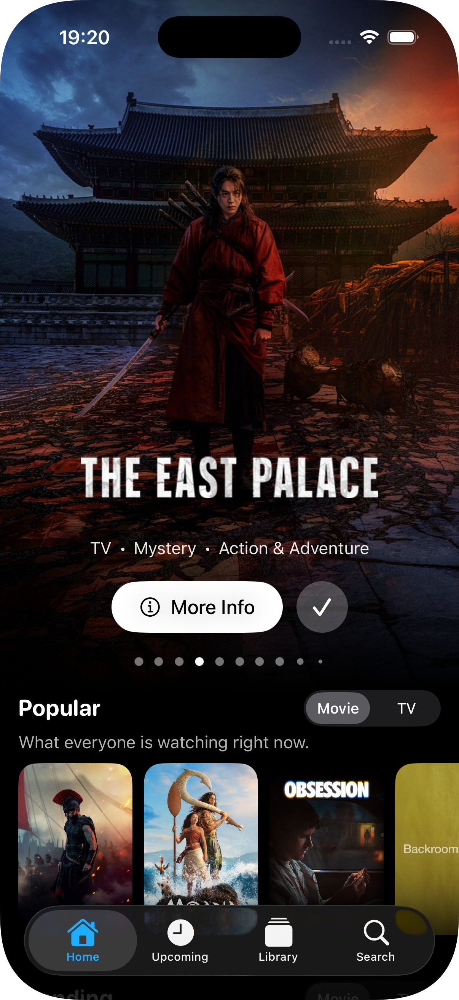
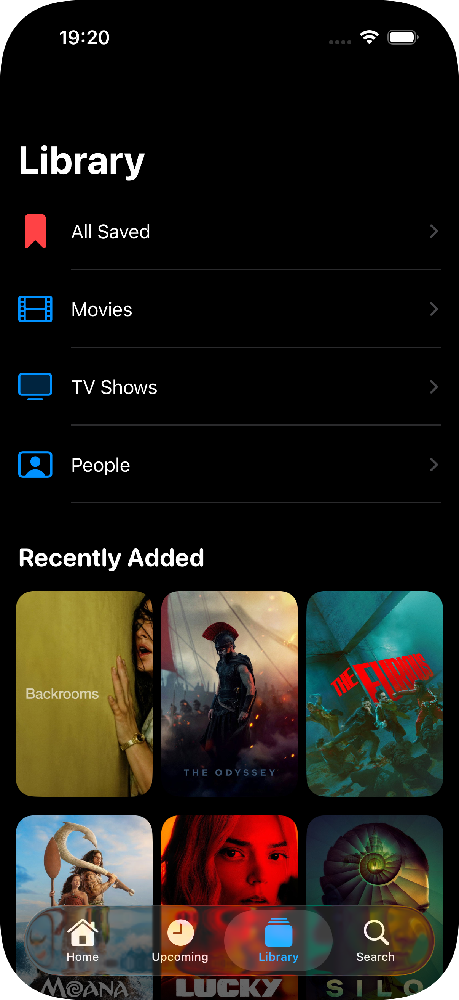
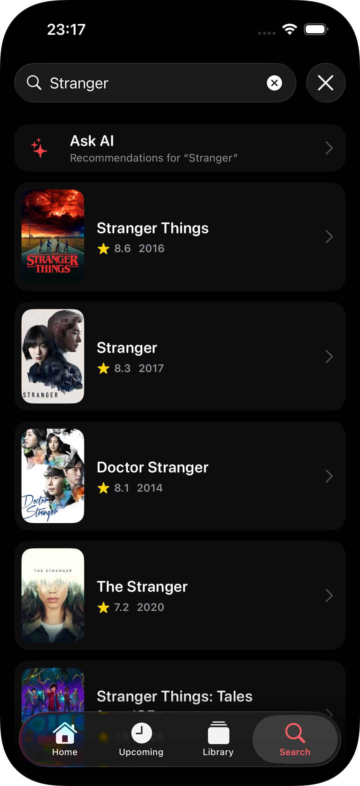

# 🎬 MovieMind

An AI-powered movie, TV show & people exploration app for iOS. Discover what to watch through natural-language recommendations from [Google Gemini](https://ai.google.dev), backed by real [TMDB](https://www.themoviedb.org) data.
Built with SwiftUI, Swift Concurrency, and SwiftData.


<p align="center">
  
  
  
  
</p>

## Features

- **AI recommendations** — a "For You" rail on Home suggests titles from your watchlist, and an "Ask AI" assistant turns a mood or vibe ("mind-bending sci-fi", "shows like The Office") into real, tappable results
- **Home** — trending hero carousel with parallax header and title logos, curated sections with Movie/TV toggles, and an AI shortcut card
- **Detail pages** — overview, metadata, cast, where-to-watch providers, similar titles, TV seasons & next-episode info, movie collections
- **Search** — debounced multi-search with infinite scroll pagination, plus an inline entry point to ask AI about the same query
- **Upcoming** — region-aware release calendar with relative dates ("Releases on Saturday")
- **Library** — persistent watchlist (SwiftData) with category filters and swipe-to-delete
- **Zoom transitions** — posters expand into detail pages with the iOS 18 `.zoom` navigation transition, everywhere they appear
- **Region-aware content** — in-theatre listings, upcoming releases, and streaming providers all follow the device locale
- **Polished loading UX** — shimmer skeleton screens on every page; content is revealed with a fade-in only after its images are cached, so posters never pop in one by one

## AI, without the hallucinations

MovieMind uses Gemini for *taste*, not for *facts*. The model never invents database IDs, posters, or ratings — it only proposes titles, which are then resolved against TMDB in a second step:

```
Watchlist / prompt ──▶ Gemini (structured JSON)         ──▶ TMDB search ──▶ real MediaItem
                       [{ title, year, mediaType }, …]        (per title)     (real id, poster, score)
```

- **Structured output** — requests set a `responseSchema`, so Gemini returns strict JSON that decodes straight into `Codable` models — no fragile text parsing
- **Grounded results** — every suggested title is looked up via TMDB `search`, matched by year, and de-duplicated; anything the model imagines that TMDB doesn't have simply drops out
- **Multi-turn chat** — "Ask AI" keeps conversation history, so follow-ups like "funnier ones" or "but shorter" work
- **Quota-friendly** — watchlist recommendations are debounced and cached by a content signature, so Gemini is only called when the watchlist actually changes
- **Fully optional** — with no Gemini key configured the AI surfaces hide themselves gracefully; the rest of the app is unaffected
- **Free tier** — resolves the current free Gemini Flash model via a `-latest` alias chain (`gemini-flash-lite-latest` → `gemini-flash-latest` → `gemini-2.5-flash`), so a deprecated model is handled automatically

## Architecture

**MVVM + protocol-oriented services:**

```
Views (SwiftUI) ──▶ ViewModels (@MainActor, ObservableObject)
                         │  ViewState<T>
              ┌──────────┴───────────┐
              ▼                      ▼
   NetworkServicing          AIServicing (protocol)
      (protocol)                     │
         │                           ▼
         ▼                   GeminiService (actor)
  NetworkManager (actor)      Gemini generateContent
   TMDB REST API v3          (JSON via responseSchema)
```

```
MovieMind/
├── App/           Entry point, tab bar, assets
├── Components/    Reusable views (HeroCard, AsyncPoster, SectionView, shimmer, …)
├── Extensions/    Date/String helpers, ZoomTransition
├── Models/        Codable domain models (media, details, credits, shared)
├── Networking/    Endpoints, NetworkManager, GenreStore, GeminiService, AI services
└── View/          Feature screens (Home, Detail, Search + Ask AI, Upcoming, Library, Collection)
```

### Key decisions

- **`ViewState<T>`** — a single enum (`idle / loading / loaded / failed`) per screen makes conflicting UI states unrepresentable; a generic `StateContainerView` renders a custom skeleton (or default spinner), a shared error + retry screen, or the content with a fade transition
- **`actor NetworkManager`** — all TMDB requests funnel through one actor; endpoints are type-safe enums behind a small `Endpoint` protocol, so adding an API call is a ~15-line enum case
- **`actor GeminiService`** — the AI layer mirrors the networking layer: an `AIServicing` protocol exposes `generate` (one-shot) and `chat` (multi-turn), both encoding a recursive `JSONSchema` and returning decoded models; a `AIMediaResolver` turns Gemini's titles into TMDB `MediaItem`s and is shared by the recommendation and chat services
- **Two-step grounding** — separating "what to suggest" (Gemini) from "what it actually is" (TMDB) keeps the model honest and reuses the existing search pipeline
- **Value-based navigation** — components emit a `MediaRoute` (or `AskAIRoute`); each `NavigationStack` resolves destinations centrally, keeping leaf views destination-agnostic
- **Zoom transitions** — a `zoomSource` / `zoomDestination` pair shares a `Namespace.ID` through the environment, so any poster can drive the `.zoom` transition without threading the namespace by hand; a per-placement source key avoids collisions when the same title appears in multiple rails
- **Image prefetching** — view models warm the shared `URLCache` before flipping state to `.loaded`; `AsyncPoster` self-heals transient failures with backoff
- **SwiftData** — lightweight watchlist persistence storing references, not payloads; details are always re-fetched fresh, and the same store seeds the AI recommendations

## Tech Stack

| | |
|---|---|
| UI | SwiftUI, [FluidHeader](https://github.com/Segyun/FluidHeader) |
| AI | Google Gemini API (Flash, free tier) with structured output |
| Concurrency | async/await, `async let`, `TaskGroup`, actors |
| Persistence | SwiftData |
| Networking | URLSession, TMDB API v3 |
| Min. iOS | 18.0 |

## Setup

1. Clone the repo
2. Get a free API key from [TMDB](https://www.themoviedb.org/settings/api)
3. *(Optional, for AI features)* Get a free key from [Google AI Studio](https://aistudio.google.com/apikey)
4. Copy `SecretsExample.xcconfig` → `Secrets.xcconfig` and add your keys:
   ```
   TMDB_API_KEY = your_tmdb_key_here
   GEMINI_API_KEY = your_gemini_key_here
   ```
5. Build & run (Xcode 16+)

`Secrets.xcconfig` is git-ignored; keys are injected at build time via Info.plist. The Gemini key is optional — leave the placeholder and the AI features simply stay hidden.

---

*Streaming availability data provided by JustWatch via TMDB.*
*This product uses the TMDB API but is not endorsed or certified by TMDB.*
*AI recommendations are generated with Google Gemini; suggestions may occasionally be imperfect.*
