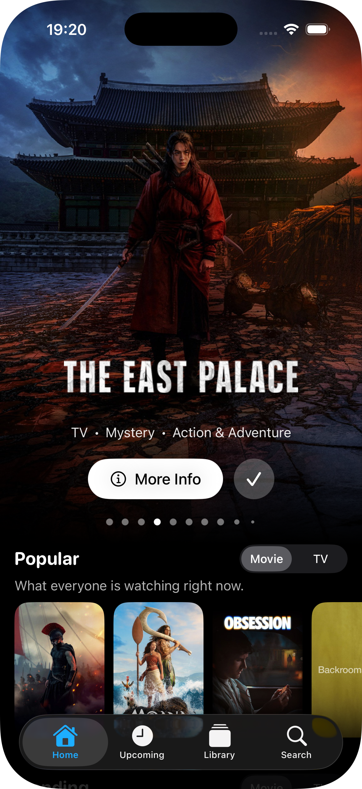
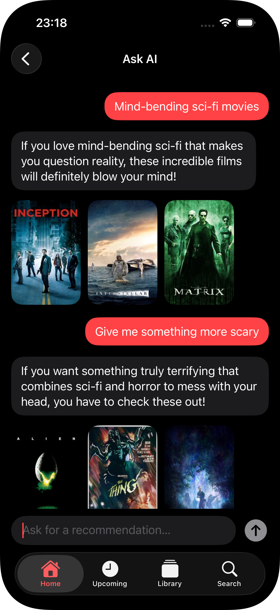
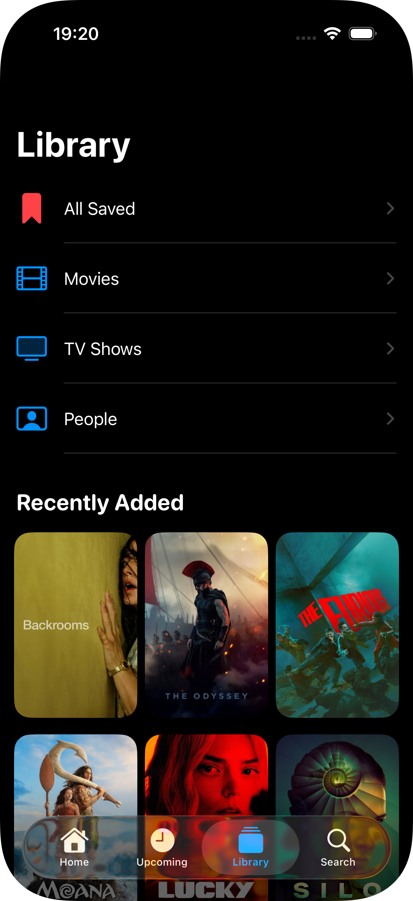
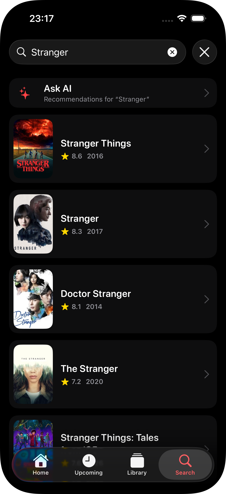

# 🎬 Movie Mind

An AI-powered movie, TV show & people exploration app for iOS. Discover what to watch through natural-language recommendations from [Google Gemini](https://ai.google.dev), backed by real [TMDB](https://www.themoviedb.org) data.
Built with SwiftUI, Swift Concurrency, and SwiftData.


<p align="center">
  
  
  
  
</p>

## Features

- **AI recommendations** — a "For You" rail on Home suggests titles from your library, and an "Ask AI" assistant.
- **Home** — trending hero carousel, sections with Movie/TV toggles.
- **Detail pages** — overview, metadata, cast, watch providers, collections and more.
- **Search** — debounced multi search, plus an inline entry point to ask AI about the same query.
- **Upcoming** — region aware release calendar with relative dates.
- **Library** — persistent library with category filters and swipe to delete action.

## AI, without the hallucinations

Movie Mind uses Gemini AI models. The model never invents database IDs, posters, or ratings — it only proposes titles, which are then resolved against TMDB in a second step:

```
Library / prompt ──▶ Gemini (structured JSON)         ──▶ TMDB search ──▶ real MediaItem
                       [{ title, year, mediaType }, …]        (per title)     (real id, poster, score)
```

- **Structured output** — requests set a `responseSchema`, so Gemini returns JSON that decodes straight into project models.
- **Grounded results** — every suggested title is looked up via TMDB `search`, matched by year, and de-duplicated.
- **Multi-turn chat** — "Ask AI" keeps conversation history, so follow ups like "funnier ones" or "but shorter" work.
- **Quota-friendly** — library recommendations are debounced and cached by a content signature, so Gemini is only called when the library actually changes.
- **Fully optional** — with no Gemini key the assistant and the "For You" rail say so instead of failing silently. Browsing, search, detail pages and the library are unaffected.
- **Free tier** — resolves the current free Gemini Flash model via a `-latest` alias chain (`gemini-flash-lite-latest` → `gemini-flash-latest` → `gemini-2.5-flash`), so a deprecated model is handled automatically.

## Architecture

**MVVM + protocol-oriented services:**

```
Views (SwiftUI) ──▶ ViewModels (@MainActor, @Observable)
                         │  ViewState<T>
              ┌──────────┴───────────┐
              ▼                      ▼
  ListServicing, etc.        AIServicing (protocol)
   (per-use-case)                    │
         │                           ▼
         ▼                   GeminiService (actor)
  NetworkManager (actor)      Gemini generateContent
   TMDB REST API v3          (JSON via responseSchema)
```

```
MovieMind/
├── App/             Entry point, tab bar, splash, assets
├── Core/            Feature-agnostic infrastructure
│   ├── Networking/  Endpoints, NetworkManager, per-use-case service protocols, secrets
│   ├── AI/          Gemini client, JSON schema, chat & recommendation services
│   ├── Images/      TMDB image URLs, Nuke-backed prefetching
│   ├── Persistence/ SwiftData model
│   └── Extensions/  Date/String helpers
├── Models/
│   ├── API/         Codable TMDB responses + the @Fallback wrapper
│   └── UI/          Presentation models + mappers
├── Navigation/      Route types, shared destinations, zoom transition
├── Components/      Reusable views (HeroCard, AsyncPoster, SectionView, SkeletonBox, …)
├── Screens/         One folder per screen: view + view model + skeleton + its own subviews
└── PreviewContent/  Fixtures for SwiftUI previews
```

### Key decisions

- **ViewState<T>** — A single enum per screen makes conflicting UI states unrepresentable. A generic `StateContainerView` renders a custom shimmering skeleton, a shared error + retry screen, or the content with a fade transition.
- **actor NetworkManager** — All TMDB requests funnel through one actor. Endpoints are type safe enums behind a small `Endpoint` protocol that defaults the query items to empty, so adding an API call is usually one case and one path line. The four calls that differ only by media type share a single `MediaEndpoint`.
- **actor GeminiService** — The AI layer mirrors the networking layer. An `AIServicing` protocol exposes `generate` and `chat`, both encoding a recursive `JSONSchema` and returning decoded models. An `AIMediaResolver` turns Gemini's titles into TMDB `MediaItem`s and is shared by the recommendation and chat services.
- **Two-step grounding** — Separating "what to suggest" (Gemini) from "what it actually is" (TMDB) keeps the model honest and reuses the existing search pipeline.
- **Value-based navigation** — Components emit a `MediaRoute`, `CollectionRoute` or `AskAIRoute` and never build a destination themselves. One `appDestinations` modifier registers all three on every stack, so a rail keeps working wherever it is reused.
- **Zoom transitions** — A `zoomSource` / `zoomDestination` pair shares a `Namespace.ID` through the environment, so any poster can drive the `.zoom` transition without threading the namespace by hand. A per placement source key avoids collisions when the same title appears in multiple rails.
- **Image prefetching** — View models hand the upcoming poster paths to Nuke's prefetcher, which warms its own disk cache while the screen is still assembling; `URLCache` is left to the JSON responses. `AsyncPoster` decodes at the size it draws and retries transient failures with backoff.
- **SwiftData** — The library stores an id, a type and just enough to draw a row: title and poster path. That copy is what makes the Library tab render offline and without one request per row, at the cost of going stale if TMDB renames a title. Detail pages are always refetched fresh, and the same store seeds the AI recommendations.

## Tech Stack

| | |
|---|---|
| UI | SwiftUI, [FluidHeader](https://github.com/Segyun/FluidHeader) |
| Images | [Nuke](https://github.com/kean/Nuke) — pipeline, disk cache, prefetching |
| AI | Google Gemini API (Flash, free tier) with structured output |
| Concurrency | async/await, async let, TaskGroup, actors |
| Persistence | SwiftData |
| Networking | URLSession, TMDB API v3 |
| Deployment Target | iOS 18.0 |

## Setup

Requires **Xcode 16+** and an iOS 18 simulator or device.

1. Clone the repo and open `MovieMind.xcodeproj`
2. Get a free API key from [TMDB](https://developer.themoviedb.org/docs/getting-started) *(required)* and, if you want the AI features, from [Google AI Studio](https://ai.google.dev/gemini-api/docs/api-key#import-projects) *(optional)*
3. Copy `MovieMind/Core/Networking/SecretsExample.xcconfig` to `Secrets.xcconfig` **in the same folder**, then fill in the keys:
   ```
   TMDB_API_KEY = your_tmdb_key_here
   GEMINI_API_KEY = your_gemini_key_here
   ```
4. Build & run

The project already points its build configuration at `Core/Networking/Secrets.xcconfig`, so the file name and location are all that matter — nothing to wire up in Xcode.

`Secrets.xcconfig` is git-ignored and the keys reach the app through Info.plist at build time. A key left at its placeholder counts as missing: without the TMDB key the app explains what to add instead of crashing, and without the Gemini key only the AI features are unavailable.

---

*Streaming availability data provided by JustWatch via TMDB.*
*This product uses the TMDB API but is not endorsed or certified by TMDB.*
*AI recommendations are generated with Google Gemini; suggestions may occasionally be imperfect.*
